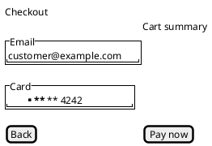

# Checkout wireframe

**Kind:** Wireframe  
**Format:** plantuml

## Diagram

```plantuml
@startuml
salt
{
  Checkout
  . | Cart summary
  {^"Email" | "customer@example.com" }
  {^"Card" | "**** **** **** 4242" }
  [Back] | [Pay now]
}
@enduml
```

## Related

- [System](/systems/northstar-commerce.md)
