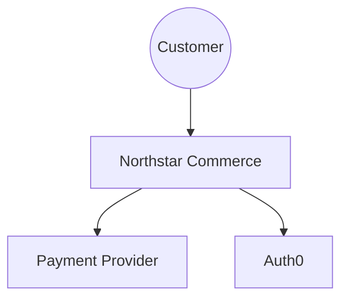

# Northstar C4 context

**Kind:** C4Diagram  
**Format:** mermaid

## Diagram

```mermaid
flowchart TB
  Customer((Customer))
  System[Northstar Commerce]
  Payments[Payment Provider]
  IdP[Auth0]
  Customer --> System
  System --> Payments
  System --> IdP
```

## Related

- [System](/systems/northstar-commerce.md)
