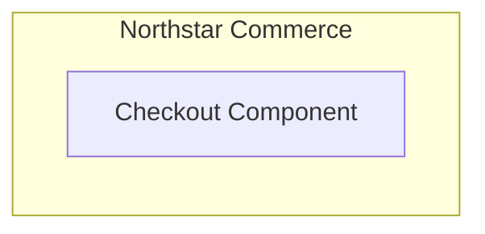

# Northstar Commerce — C4 L3 Components

**C4 level:** 3  
**Generated from:** SAC second brain inventory

## Diagram

## Notes

Auto-generated C4 view. Refine edges and technology tags manually; link with `c4_view_of` / `zooms_into`.
