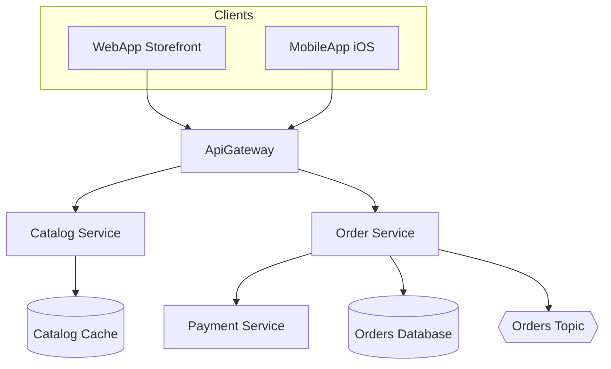

# Northstar context architecture

**Kind:** ArchitectureDiagram  
**Format:** mermaid

## Diagram

```mermaid
flowchart TB
  subgraph Clients
    Web[WebApp Storefront]
    iOS[MobileApp iOS]
  end
  GW[ApiGateway]
  Cat[Catalog Service]
  Ord[Order Service]
  Pay[Payment Service]
  DB[(Orders Database)]
  Cache[(Catalog Cache)]
  Bus{{Orders Topic}}
  Web --> GW
  iOS --> GW
  GW --> Cat
  GW --> Ord
  Ord --> Pay
  Ord --> DB
  Cat --> Cache
  Ord --> Bus
```

## Related

- [System](/systems/northstar-commerce.md)
