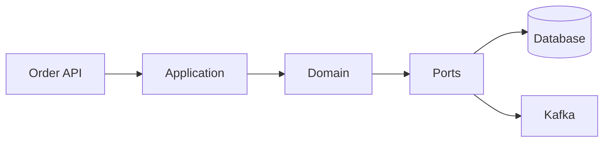

# Order service components

**Kind:** ComponentDiagram  
**Format:** mermaid

## Diagram

```mermaid
flowchart LR
  API[Order API] --> App[Application]
  App --> Dom[Domain]
  Dom --> Ports[Ports]
  Ports --> PG[(Database)]
  Ports --> K[Kafka]
```

## Related

- [System](/systems/northstar-commerce.md)
