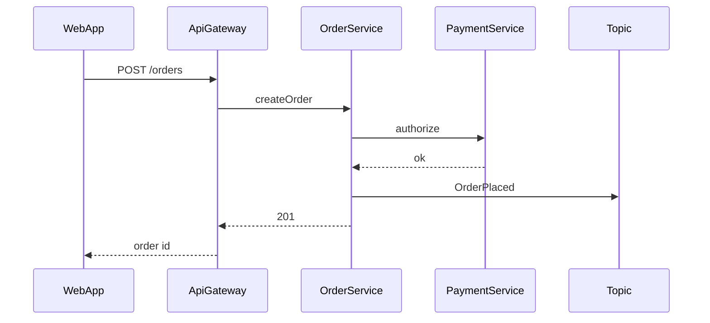

# Place order sequence

**Kind:** SequenceDiagram  
**Format:** mermaid

## Diagram

```mermaid
sequenceDiagram
  participant Web as WebApp
  participant GW as ApiGateway
  participant Ord as OrderService
  participant Pay as PaymentService
  participant Bus as Topic
  Web->>GW: POST /orders
  GW->>Ord: createOrder
  Ord->>Pay: authorize
  Pay-->>Ord: ok
  Ord->>Bus: OrderPlaced
  Ord-->>GW: 201
  GW-->>Web: order id
```

## Related

- [System](/systems/northstar-commerce.md)
