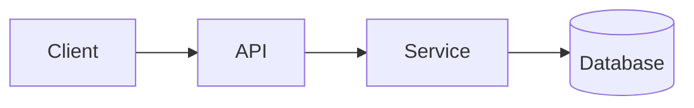

# Example diagram

## Diagram

## Notes

- Prefer specific types: Wireframe, ArchitectureDiagram, ComponentDiagram, SequenceDiagram, ActivityDiagram, StateMachineDiagram, ClassDiagram, ErdDiagram, DeploymentDiagram, C4Diagram.
- Keep listings inside fenced code blocks so the second brain stays portable Markdown.
