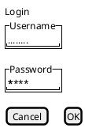

# Example wireframe

## Diagram

```plantuml
@startuml
salt
{
  Login
  {^"Username" | "........" }
  {^"Password" | "********" }
  [Cancel] | [OK]
}
@enduml
```

## Related surfaces

- Link to WebApp / MobileApp / Channel concepts
